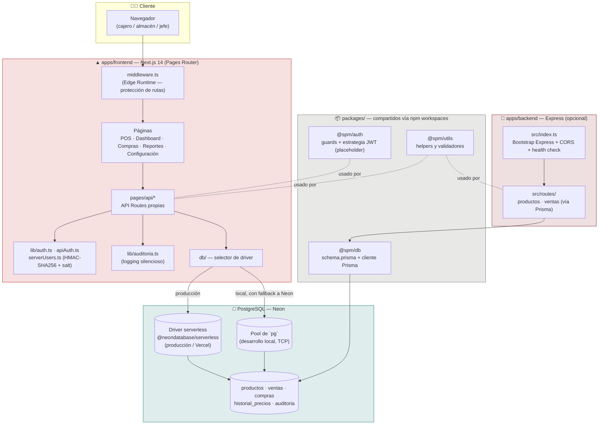
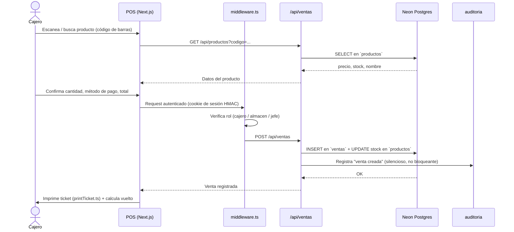
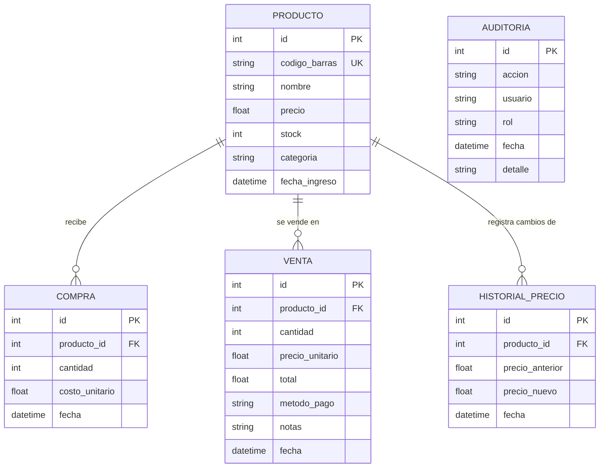
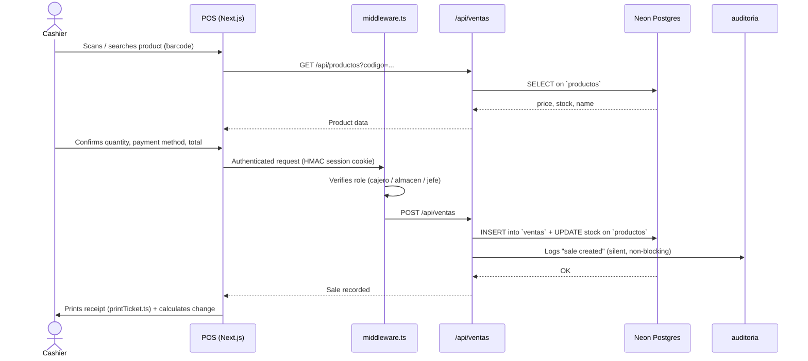
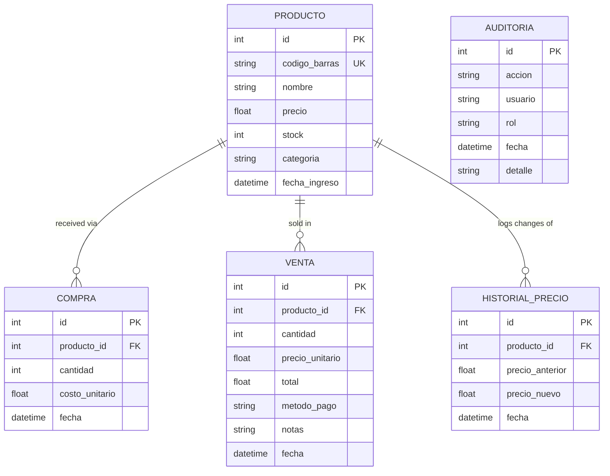

<p align="center">
  
</p>

<p align="center">
  
</p>

<p align="center">
  
  
  
  
  
  
  
  
</p>

<p align="center">
  
</p>

<p align="center">
  <a href="#español"><b>🇪🇸 Español</b></a> &nbsp;·&nbsp; <a href="#english"><b>🇬🇧 English</b></a>
</p>

---

<a name="español"></a>
## 🇪🇸 Español

### 📑 Tabla de contenidos

- [¿Qué es SPM?](#qué-es-spm)
- [Arquitectura](#arquitectura)
- [Flujo de una venta](#flujo-de-una-venta)
- [Características principales](#características-principales)
- [Modelo de datos](#modelo-de-datos)
- [Stack tecnológico](#stack-tecnológico)
- [Estructura del proyecto](#estructura-del-proyecto)
- [Seguridad y control de acceso](#seguridad-y-control-de-acceso)
- [Estado del proyecto y roadmap](#estado-del-proyecto-y-roadmap)
- [Licencia](#licencia)
- [Autor](#autor)

---

### ¿Qué es SPM?

**SPM** (Sistema de Punto de Venta) es una aplicación de gestión comercial pensada para negocios pequeños — kioscos, minimarkets, tiendas de barrio — que necesitan controlar inventario, vender en caja, comprar a proveedores y auditar todo lo que pasa en el local, sin depender de una suite de ERP pesada ni de personal técnico para operarla.

Todo el dominio está modelado en español (tablas, campos, textos de UI): `productos`, `ventas`, `compras`, `historial_precios`, `auditoria`. La aplicación fue diseñada para que la use directamente el personal de mostrador, con permisos distintos según si la persona es dueño/administrador, encargado de almacén o cajero.

Dentro del propio código conviven **dos nombres comerciales**, algo que vale la pena documentar con honestidad porque es visible para cualquiera que abra el repo:

- **"KIOSKO ROJO"** — branding de la landing / página de bienvenida, atribuido a **"ALLDRIX FOUNDRY"**.
- **"VEROKAI POS"** — nombre de tienda que viene por defecto en el panel de configuración (`configuracion.tsx`).

Esto sugiere que la base de código funciona como una **plantilla de POS reutilizada y re-etiquetada** para distintos clientes o marcas — un patrón habitual cuando un mismo desarrollador mantiene varios repos de POS muy parecidos entre sí. De hecho existe también [`jackson1939/AXIS-SPM-SS`](https://github.com/jackson1939/AXIS-SPM-SS), del mismo autor, que por nombre y propósito parece emparentado con este proyecto — aunque no se encontró en **este** repositorio ninguna referencia directa o dependencia cruzada explícita hacia él.

**Nivel de madurez:** proyecto funcional en desarrollo activo, más cerca de un **MVP avanzado** que de un prototipo. Tiene autenticación real, RBAC, auditoría, exportación a Excel, impresión de tickets y ya está desplegado en Vercel. Dicho esto, el historial de git del repositorio fue reducido a un único commit visible antes de este README (`PARCHE DE SEGURIDAD 1`), lo que indica que se aplicó un parche de seguridad reciente — probablemente por una exposición previa de credenciales — y que el historial completo del proyecto no se conserva. Tampoco se encontraron pruebas automatizadas: `npm run test` existe como script en `package.json`, pero no hay archivos de test en el repo.

### Arquitectura

SPM es, en realidad, **dos aplicaciones que comparten un mismo esquema de base de datos pero acceden a él por caminos distintos**: el frontend Next.js resuelve su propia API con SQL crudo contra `pg`/Neon, mientras que un backend Express independiente y opcional expone una API paralela usando Prisma. No hay una capa de servicio compartida entre ambos — son dos implementaciones de acceso a datos apuntando al mismo Postgres.



> **Nota clave:** el frontend no llama al backend Express, ni viceversa. Ambos son puntos de entrada independientes a la misma base de datos. El backend Express usa **Prisma** (`packages/db`) como capa de acceso; las API routes de Next.js usan **SQL crudo** con el driver que corresponda al entorno (`@neondatabase/serverless` en Vercel, `pg.Pool` con fallback a Neon en local). Mantener el esquema sincronizado entre ambas rutas de acceso es responsabilidad manual de quien modifique el modelo de datos.

### Flujo de una venta

El ciclo operativo típico de caja, de punta a punta:



### Características principales

**Gestión de inventario**
- Alta, edición, baja y consulta de productos con **código de barras único**, nombre, precio, stock, categoría y fecha de ingreso.
- **Historial de precios** (`HistorialPrecio`): cada cambio de precio queda registrado, permitiendo auditar variaciones en el tiempo.
- Búsqueda / escaneo de productos por código de barras (`pages/scan.tsx`).

**Punto de venta (POS) y compras**
- Registro de ventas por producto y cantidad, métodos de pago, notas, cálculo automático de total y **vuelto**.
- Impresión de tickets de venta (`utils/printTicket.ts`).
- Registro de compras a proveedores con costo unitario y actualización automática de stock (`pages/compras.tsx`, `pages/api/compras.ts`).

**Reportes y dashboard**
- Vistas de reportes de ventas e inventario (`pages/reportes.tsx`); `docs/api-spec.md` documenta además endpoints de reportes en el backend Express.
- Dashboard operativo: ventas de hoy vs. ayer, total de productos, alertas de stock bajo, compras del mes.
- **Exportación a Excel** de los datos operativos (librería `xlsx` / SheetJS).

**Autenticación y sesiones propias — sin librerías externas de auth**
- Login usuario/contraseña con hash **HMAC-SHA256 + salt** (nunca texto plano) y comparación en tiempo constante (`crypto.timingSafeEqual`) para mitigar *timing attacks*.
- Sesión firmada con HMAC en cookie `HttpOnly`, `SameSite=Lax`, `Secure` en producción, expiración de **12 horas**.
- Usuarios adicionales configurables sin tocar código vía la variable `SPM_APP_USERS_JSON`.
- Cierre de sesión automático por inactividad (**17 minutos**, `useSessionTimeout`), pensado explícitamente para no agotar el pool de conexiones de Neon.

**Control de acceso basado en roles (RBAC)**
- Tres roles — `jefe`, `almacen`, `cajero` — verificados **tanto en servidor** (`middleware.ts`, `requireAuth`) **como en cliente** (`useRoleGuard`, con *fallback* a `localStorage` si la red falla).

**Auditoría de acciones**
- Toda acción sensible (login, logout, venta creada, compra creada, producto creado/editado/eliminado, configuración actualizada, migración ejecutada, base de datos vaciada) se registra en la tabla `auditoria`, de forma silenciosa: si el registro de auditoría falla, la operación principal no se interrumpe.

**Panel de configuración**
- Nombre y datos de la tienda, símbolo de moneda, umbral de stock bajo, credenciales, impresora y pie de ticket, todo configurable desde `pages/configuracion.tsx`.

**Endpoint administrativo de borrado total**
- `/api/admin/clear-database`, exclusivo del rol `jefe`, requiere confirmación explícita en el body (`"BORRAR TODO"`) — acción irreversible y auditada.

**Doble estrategia de base de datos según entorno**
- En **Vercel/producción**: driver serverless `@neondatabase/serverless` (HTTP, apto para funciones serverless).
- En **desarrollo local**: `Pool` tradicional de `pg` (TCP), con *fallback* automático a Neon si el pool falla.

**Backend Express independiente (opcional)**
- Expone parte de la misma API (`productos`, `ventas`, `compras`, `reportes`) usando **Prisma ORM** en lugar de SQL crudo — útil como alternativa desacoplada de Vercel o como base para integraciones futuras.

**Detalles de UI**
- Tema claro/oscuro persistido en `localStorage` en la landing page.

### Modelo de datos

Modelo real definido en `packages/db/prisma/schema.prisma`, más la tabla `auditoria`, que **no** está modelada en Prisma y se escribe con SQL crudo desde `lib/auditoria.ts`:



> `HISTORIAL_PRECIO` tiene borrado en cascada respecto a `PRODUCTO`. `AUDITORIA` es una tabla independiente, sin relaciones formales en el esquema de Prisma — se popula por fuera del ORM, exclusivamente vía SQL crudo desde el backend Next.js.

### Stack tecnológico

| Categoría | Tecnología / Librería | Versión |
|---|---|---|
| Lenguaje | TypeScript | ^5.3.3 |
| Frontend | Next.js (Pages Router) | ^14.1.0 |
| UI | React / React DOM | ^18.2.0 |
| Estilos | Tailwind CSS + PostCSS + Autoprefixer | ^3.4.19 |
| Iconos | react-icons | ^5.5.0 |
| Exportación | xlsx (SheetJS) | ^0.18.5 |
| Backend alterno | Express | ^4.18.2 |
| Runtime dev backend | tsx (watch mode) | ^4.7.0 |
| ORM | Prisma / @prisma/client | ^5.9.1 |
| Base de datos | PostgreSQL gestionado por **Neon** | — |
| Driver DB (local) | `pg` (node-postgres) | ^8.11.3 |
| Driver DB (serverless) | `@neondatabase/serverless` | ^1.0.2 |
| Hashing de contraseñas (backend Express) | bcrypt | ^6.0.0 |
| CORS | cors | ^2.8.5 |
| Variables de entorno | dotenv | ^16.4.1 |
| Gestor de monorepo | npm workspaces | npm ≥ 9 |
| Despliegue | Vercel | — |

> El hash de contraseñas del **login del frontend** (`serverUsers.ts`) usa `crypto.createHmac` nativo de Node, **no** `bcrypt` — `bcrypt` solo figura como dependencia del backend Express, que usa un mecanismo de auth distinto (placeholder JWT en `@spm/auth`).

### Estructura del proyecto

```mermaid
graph TD
    Root["SPM/ (monorepo npm workspaces)"] --> Apps["apps/"]
    Root --> Packages["packages/"]
    Root --> Docs["docs/"]
    Root --> Scripts["scripts/"]
    Root --> Vercel["vercel.json"]

    Apps --> FE["frontend/ — Next.js 14"]
    Apps --> BE["backend/ — Express (opcional)"]

    FE --> FEPages["pages/<br/>POS · dashboard · login · reportes · compras · scan · configuracion"]
    FEPages --> FEApi["pages/api/<br/>auth · productos · ventas · compras · admin · migrate"]
    FE --> FEComp["components/<br/>Layout, AccesoDenegado"]
    FE --> FEHooks["hooks/<br/>useRoleGuard · useSessionTimeout"]
    FE --> FELib["lib/<br/>auth.ts · apiAuth.ts · serverUsers.ts · auditoria.ts"]
    FE --> FEUtils["utils/<br/>formatPrecio · printTicket · exportExcel"]
    FE --> FEDb["db/<br/>selector pg vs Neon serverless"]
    FE --> FEMw["middleware.ts<br/>Edge Runtime"]

    BE --> BESrc["src/index.ts<br/>bootstrap Express"]
    BE --> BERoutes["src/routes/<br/>productos, ventas vía Prisma"]
    BE --> BEApi["pages/api/<br/>variante compras/productos/reportes/ventas"]
    BE --> BEDb["db/<br/>config + esquema SQL de referencia"]
    BE --> BEScripts["scripts/<br/>migrate.js · test-connection.js"]

    Packages --> PDb["db/ — @spm/db<br/>schema.prisma + cliente Prisma"]
    Packages --> PAuth["auth/ — @spm/auth<br/>strategies (JWT placeholder) + guards"]
    Packages --> PUtils["utils/ — @spm/utils<br/>helpers + validadores"]

    Docs --> DArch["arquitectura.md"]
    Docs --> DApi["api-spec.md"]
    Docs --> DRoad["roadmap.md"]
    Docs --> DSql["db-schema.sql"]

    style Apps fill:#B91C122,stroke:#B91C1C
    style Packages fill:#57534e22,stroke:#78716c
    style Docs fill:#0f766e22,stroke:#0f766e
```



### Seguridad y control de acceso

Resumen del modelo de seguridad implementado, con notas honestas sobre su historial:

- **Contraseñas:** hash HMAC-SHA256 con salt para el login del frontend (no bcrypt, no una librería de terceros) — implementación propia en `serverUsers.ts`, con comparación en tiempo constante.
- **Sesiones:** cookie firmada con HMAC, `HttpOnly` + `SameSite=Lax` + `Secure` en producción, expiración de 12 horas, con logout automático por inactividad a los 17 minutos.
- **RBAC de 3 roles** (`jefe`, `almacen`, `cajero`) validado en servidor (Edge Middleware) y en cliente, con degradación controlada (`localStorage`) si la verificación de red falla.
- **Auditoría no bloqueante:** un fallo al escribir en la tabla `auditoria` nunca interrumpe la operación de negocio que la originó.
- **Historial de git reducido:** el repositorio, tal como está clonado, expone un único commit anterior a este trabajo de documentación — `PARCHE DE SEGURIDAD 1` — lo que sugiere que en algún momento se resolvió (y se ocultó del historial) una exposición de credenciales u otro incidente de seguridad. No hay forma de auditar, desde este repo, qué contenía el historial original.
- **Branding dual sin explicar:** la convivencia de "KIOSKO ROJO / ALLDRIX FOUNDRY" y "VEROKAI POS" dentro del mismo código (ver [¿Qué es SPM?](#qué-es-spm)) no está documentada en ningún lado del propio repositorio; se deja constancia aquí para quien continúe el mantenimiento.

### Estado del proyecto y roadmap

`docs/roadmap.md` define 4 fases, pero está **desactualizado respecto al código real** — varias features que ahí figuran como pendientes ya están implementadas:

- [x] Estructura del monorepo (npm workspaces, `apps/` + `packages/`).
- [x] Base de datos configurada (Neon Postgres + Prisma + `pg`).
- [x] Autenticación implementada — y más completa que "básica": incluye RBAC, auditoría y expiración de sesión.
- [x] Gestión de productos (alta/edición/baja + historial de precios).
- [x] POS / ventas con impresión de ticket y cálculo de vuelto.
- [x] Gestión de compras a proveedores.
- [x] Exportación a Excel y dashboard operativo.
- [ ] Roadmap del propio repo (`docs/roadmap.md`) desactualizado — recomendable sincronizarlo con el estado real.
- [ ] Reportes y analytics — existen páginas/endpoints, pero su cobertura funcional no fue auditada a fondo.
- [ ] Testing automatizado — `npm run test` existe como script pero no hay suite de tests en el repo.
- [ ] Autenticación de dos factores (mencionada en el roadmap, no implementada).
- [ ] Unificar la capa de acceso a datos (hoy dividida entre SQL crudo en el frontend y Prisma en el backend Express).
- [ ] Aclarar y documentar el branding dual KIOSKO ROJO / VEROKAI POS.

### Licencia

El repositorio **no incluye un archivo `LICENSE`**. Por lo tanto:

**Todos los derechos reservados — proyecto de jackson1939.** No se otorga licencia de uso, copia, modificación o distribución salvo autorización expresa del autor.

### Autor

<p align="left">
  <a href="https://github.com/jackson1939"></a>
</p>

- Repositorio relacionado (mismo autor, posible proyecto emparentado por nombre/propósito): [jackson1939/AXIS-SPM-SS](https://github.com/jackson1939/AXIS-SPM-SS)

---

<a name="english"></a>
## 🇬🇧 English

### 📑 Table of contents

- [What is SPM?](#what-is-spm)
- [Architecture](#architecture)
- [Sale flow](#sale-flow)
- [Key features](#key-features)
- [Data model](#data-model)
- [Tech stack](#tech-stack)
- [Project structure](#project-structure)
- [Security and access control](#security-and-access-control)
- [Project status and roadmap](#project-status-and-roadmap)
- [License](#license)
- [Author](#author)

---

### What is SPM?

**SPM** (Sistema de Punto de Venta / Point-of-Sale System) is a business management application built for small retail businesses — kiosks, mini-markets, corner stores — that need to control inventory, run checkout, buy from suppliers, and audit everything that happens at the register, without a heavyweight ERP suite or technical staff to run it.

The entire domain is modeled in Spanish (tables, fields, UI copy): `productos`, `ventas`, `compras`, `historial_precios`, `auditoria`. The app is meant to be operated directly by counter staff, with different permissions depending on whether the person is the owner/admin, the warehouse manager, or a cashier.

The codebase itself carries **two commercial brand names**, worth documenting honestly since anyone opening the repo will see them:

- **"KIOSKO ROJO"** — branding on the landing / welcome page, attributed to **"ALLDRIX FOUNDRY"**.
- **"VEROKAI POS"** — the default store name shipped in the configuration panel (`configuracion.tsx`).

This suggests the codebase works as a **reused, rebranded POS template** for different clients or brands — a common pattern when the same developer maintains several very similar POS repos. In fact, [`jackson1939/AXIS-SPM-SS`](https://github.com/jackson1939/AXIS-SPM-SS) also exists under the same author and looks related by name and purpose — though no direct reference or cross-dependency to it was found **within this repository**.

**Maturity level:** a working project in active development, closer to an **advanced MVP** than a prototype. It has real authentication, RBAC, audit logging, Excel export, receipt printing, and is already deployed on Vercel. That said, the repository's git history was squashed to a single commit visible before this documentation pass (`PARCHE DE SEGURIDAD 1` / "SECURITY PATCH 1"), indicating a recent security patch — likely for a prior credential exposure — and that the project's full history is not retained. No automated tests were found either: `npm run test` exists as a script in `package.json`, but there are no test files in the repo.

### Architecture

SPM is, in practice, **two applications sharing one database schema through two different access paths**: the Next.js frontend resolves its own API with raw SQL against `pg`/Neon, while an independent, optional Express backend exposes a parallel API using Prisma. There is no shared service layer between the two — they are two separate data-access implementations pointing at the same Postgres instance.

```mermaid
graph TB
    subgraph Cliente["🧑‍💻 Client"]
        Browser["Browser<br/>(cashier / warehouse / boss)"]
    end

    subgraph Frontend["▲ apps/frontend — Next.js 14 (Pages Router)"]
        Pages["Pages<br/>POS · Dashboard · Purchases · Reports · Settings"]
        MW["middleware.ts<br/>(Edge Runtime — route protection)"]
        API["pages/api/*<br/>Own API Routes"]
        Auth["lib/auth.ts · apiAuth.ts<br/>serverUsers.ts (HMAC-SHA256 + salt)"]
        Audit["lib/auditoria.ts<br/>(silent logging)"]
        DBSel["db/ — driver selector"]
    end

    subgraph BackendOpt["🔧 apps/backend — Express (optional)"]
        Express["src/index.ts<br/>Express bootstrap + CORS + health check"]
        Routes["src/routes/<br/>products · sales (via Prisma)"]
    end

    subgraph Packages["📦 packages/ — shared via npm workspaces"]
        PDB["@spm/db<br/>schema.prisma + Prisma client"]
        PAuth["@spm/auth<br/>guards + JWT strategy (placeholder)"]
        PUtils["@spm/utils<br/>helpers and validators"]
    end

    subgraph Datos["💾 PostgreSQL — Neon"]
        Pooled[("Serverless driver<br/>@neondatabase/serverless<br/>(production / Vercel)")]
        Local[("`pg` Pool<br/>(local dev, TCP)")]
        DB[("productos · ventas · compras<br/>historial_precios · auditoria")]
    end

    Browser --> MW --> Pages
    Pages --> API
    API --> Auth
    API --> Audit
    API --> DBSel
    DBSel -->|production| Pooled --> DB
    DBSel -->|local, falls back to Neon| Local --> DB

    Express --> Routes --> PDB --> DB
    PAuth -. used by .- API
    PUtils -. used by .- API
    PUtils -. used by .- Routes

    style Frontend fill:#B91C1C22,stroke:#B91C1C
    style BackendOpt fill:#7F1D1D22,stroke:#7F1D1D
    style Datos fill:#0f766e22,stroke:#0f766e
    style Packages fill:#57534e22,stroke:#78716c
```

> **Key note:** the frontend never calls the Express backend, or vice-versa. Both are independent entry points into the same database. The Express backend uses **Prisma** (`packages/db`) as its access layer; the Next.js API routes use **raw SQL** through whichever driver fits the environment (`@neondatabase/serverless` on Vercel, `pg.Pool` with a Neon fallback locally). Keeping the schema in sync across both access paths is a manual responsibility for whoever changes the data model.

### Sale flow

A typical end-to-end checkout cycle:



### Key features

**Inventory management**
- Create, edit, delete and browse products with a **unique barcode**, name, price, stock, category and intake date.
- **Price history** (`HistorialPrecio`): every price change is logged, allowing variations to be audited over time.
- Product search/scan by barcode (`pages/scan.tsx`).

**Point of sale (POS) and purchases**
- Record sales by product and quantity, payment methods, notes, automatic total and **change-due** calculation.
- Receipt printing (`utils/printTicket.ts`).
- Supplier purchase logging with unit cost and automatic stock updates (`pages/compras.tsx`, `pages/api/compras.ts`).

**Reports and dashboard**
- Sales and inventory report views (`pages/reportes.tsx`); `docs/api-spec.md` also documents report endpoints on the Express backend.
- Operational dashboard: today vs. yesterday sales, total products, low-stock alerts, monthly purchases.
- **Excel export** of operational data (`xlsx` / SheetJS library).

**Custom authentication and sessions — no third-party auth library**
- Username/password login with **HMAC-SHA256 + salt** hashing (never plain text) and constant-time comparison (`crypto.timingSafeEqual`) to mitigate timing attacks.
- HMAC-signed session in an `HttpOnly`, `SameSite=Lax` cookie, `Secure` in production, **12-hour** expiration.
- Extra users configurable without touching code via the `SPM_APP_USERS_JSON` environment variable.
- Automatic logout on inactivity (**17 minutes**, `useSessionTimeout`), explicitly meant to avoid exhausting the Neon connection pool.

**Role-based access control (RBAC)**
- Three roles — `jefe` (boss/admin), `almacen` (warehouse), `cajero` (cashier) — enforced **both server-side** (`middleware.ts`, `requireAuth`) **and client-side** (`useRoleGuard`, with a `localStorage` fallback if the network fails).

**Action auditing**
- Every sensitive action (login, logout, sale created, purchase created, product created/edited/deleted, config updated, migration run, database cleared) is logged to the `auditoria` table, silently: a failed audit write never blocks the underlying business operation.

**Configuration panel**
- Store name/details, currency symbol, low-stock threshold, credentials, printer, and receipt footer — all configurable from `pages/configuracion.tsx`.

**Admin "wipe database" endpoint**
- `/api/admin/clear-database`, restricted to the `jefe` role, requires explicit confirmation in the request body (`"BORRAR TODO"`) — an irreversible, audited action.

**Dual database strategy per environment**
- On **Vercel/production**: the `@neondatabase/serverless` HTTP driver, suited for serverless functions.
- In **local development**: a traditional `pg` `Pool` (TCP), with automatic fallback to Neon if the pool fails.

**Standalone Express backend (optional)**
- Exposes part of the same API (`productos`, `ventas`, `compras`, `reportes`) using **Prisma ORM** instead of raw SQL — useful as a Vercel-decoupled alternative or as a base for future integrations.

**UI details**
- Light/dark theme persisted in `localStorage` on the landing page.

### Data model

The real model, defined in `packages/db/prisma/schema.prisma`, plus the `auditoria` table, which is **not** modeled in Prisma and is written via raw SQL from `lib/auditoria.ts`:



> `HISTORIAL_PRECIO` cascades on delete from `PRODUCTO`. `AUDITORIA` is a standalone table with no formal relations in the Prisma schema — it is populated outside the ORM, exclusively via raw SQL from the Next.js backend.

### Tech stack

| Category | Technology / Library | Version |
|---|---|---|
| Language | TypeScript | ^5.3.3 |
| Frontend | Next.js (Pages Router) | ^14.1.0 |
| UI | React / React DOM | ^18.2.0 |
| Styling | Tailwind CSS + PostCSS + Autoprefixer | ^3.4.19 |
| Icons | react-icons | ^5.5.0 |
| Export | xlsx (SheetJS) | ^0.18.5 |
| Alternate backend | Express | ^4.18.2 |
| Backend dev runtime | tsx (watch mode) | ^4.7.0 |
| ORM | Prisma / @prisma/client | ^5.9.1 |
| Database | PostgreSQL, managed by **Neon** | — |
| DB driver (local) | `pg` (node-postgres) | ^8.11.3 |
| DB driver (serverless) | `@neondatabase/serverless` | ^1.0.2 |
| Password hashing (Express backend) | bcrypt | ^6.0.0 |
| CORS | cors | ^2.8.5 |
| Env vars | dotenv | ^16.4.1 |
| Monorepo manager | npm workspaces | npm ≥ 9 |
| Deployment | Vercel | — |

> Password hashing for the **frontend login** (`serverUsers.ts`) uses Node's native `crypto.createHmac`, **not** `bcrypt` — `bcrypt` only appears as a dependency of the Express backend, which uses a different auth mechanism entirely (a JWT placeholder in `@spm/auth`).

### Project structure

```mermaid
graph TD
    Root["SPM/ (npm workspaces monorepo)"] --> Apps["apps/"]
    Root --> Packages["packages/"]
    Root --> Docs["docs/"]
    Root --> Scripts["scripts/"]
    Root --> Vercel["vercel.json"]

    Apps --> FE["frontend/ — Next.js 14"]
    Apps --> BE["backend/ — Express (optional)"]

    FE --> FEPages["pages/<br/>POS · dashboard · login · reports · purchases · scan · settings"]
    FEPages --> FEApi["pages/api/<br/>auth · products · sales · purchases · admin · migrate"]
    FE --> FEComp["components/<br/>Layout, AccesoDenegado"]
    FE --> FEHooks["hooks/<br/>useRoleGuard · useSessionTimeout"]
    FE --> FELib["lib/<br/>auth.ts · apiAuth.ts · serverUsers.ts · auditoria.ts"]
    FE --> FEUtils["utils/<br/>formatPrecio · printTicket · exportExcel"]
    FE --> FEDb["db/<br/>pg vs Neon serverless selector"]
    FE --> FEMw["middleware.ts<br/>Edge Runtime"]

    BE --> BESrc["src/index.ts<br/>Express bootstrap"]
    BE --> BERoutes["src/routes/<br/>products, sales via Prisma"]
    BE --> BEApi["pages/api/<br/>alternate purchases/products/reports/sales"]
    BE --> BEDb["db/<br/>config + reference SQL schema"]
    BE --> BEScripts["scripts/<br/>migrate.js · test-connection.js"]

    Packages --> PDb["db/ — @spm/db<br/>schema.prisma + Prisma client"]
    Packages --> PAuth["auth/ — @spm/auth<br/>strategies (JWT placeholder) + guards"]
    Packages --> PUtils["utils/ — @spm/utils<br/>helpers + validators"]

    Docs --> DArch["arquitectura.md"]
    Docs --> DApi["api-spec.md"]
    Docs --> DRoad["roadmap.md"]
    Docs --> DSql["db-schema.sql"]

    style Apps fill:#B91C122,stroke:#B91C1C
    style Packages fill:#57534e22,stroke:#78716c
    style Docs fill:#0f766e22,stroke:#0f766e
```



### Security and access control

A summary of the implemented security model, with honest notes on its history:

- **Passwords:** HMAC-SHA256 hashing with salt for the frontend login (no bcrypt, no third-party library) — a custom implementation in `serverUsers.ts`, with constant-time comparison.
- **Sessions:** HMAC-signed cookie, `HttpOnly` + `SameSite=Lax` + `Secure` in production, 12-hour expiration, with automatic logout on 17 minutes of inactivity.
- **3-role RBAC** (`jefe`, `almacen`, `cajero`) validated server-side (Edge Middleware) and client-side, with controlled degradation (`localStorage`) if the network check fails.
- **Non-blocking auditing:** a failure writing to the `auditoria` table never interrupts the business operation that triggered it.
- **Squashed git history:** the repository, as cloned, exposes a single commit predating this documentation work — `PARCHE DE SEGURIDAD 1` ("SECURITY PATCH 1") — suggesting that at some point a credential exposure or other security incident was resolved (and hidden from history). There is no way to audit, from this repo alone, what the original history contained.
- **Unexplained dual branding:** the coexistence of "KIOSKO ROJO / ALLDRIX FOUNDRY" and "VEROKAI POS" within the same codebase (see [What is SPM?](#what-is-spm)) is not documented anywhere in the repository itself; it is noted here for whoever continues maintaining it.

### Project status and roadmap

`docs/roadmap.md` defines 4 phases, but it is **out of date relative to the actual code** — several features listed there as pending are already implemented:

- [x] Monorepo structure (npm workspaces, `apps/` + `packages/`).
- [x] Database configured (Neon Postgres + Prisma + `pg`).
- [x] Authentication implemented — and more complete than "basic": includes RBAC, auditing, and session expiration.
- [x] Product management (create/edit/delete + price history).
- [x] POS / sales with receipt printing and change-due calculation.
- [x] Supplier purchase management.
- [x] Excel export and operational dashboard.
- [ ] The repo's own roadmap (`docs/roadmap.md`) is stale — worth syncing with actual status.
- [ ] Reports and analytics — pages/endpoints exist, but functional coverage was not deeply audited.
- [ ] Automated testing — `npm run test` exists as a script but there is no test suite in the repo.
- [ ] Two-factor authentication (mentioned in the roadmap, not implemented).
- [ ] Unify the data access layer (currently split between raw SQL in the frontend and Prisma in the Express backend).
- [ ] Clarify and document the dual KIOSKO ROJO / VEROKAI POS branding.

### License

The repository **does not include a `LICENSE` file**. Therefore:

**All rights reserved — a project by jackson1939.** No license to use, copy, modify or distribute is granted without the author's express permission.

### Author

<p align="left">
  <a href="https://github.com/jackson1939"></a>
</p>

- Related repository (same author, possibly related by name/purpose): [jackson1939/AXIS-SPM-SS](https://github.com/jackson1939/AXIS-SPM-SS)

<p align="center">
  
</p>
